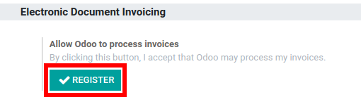
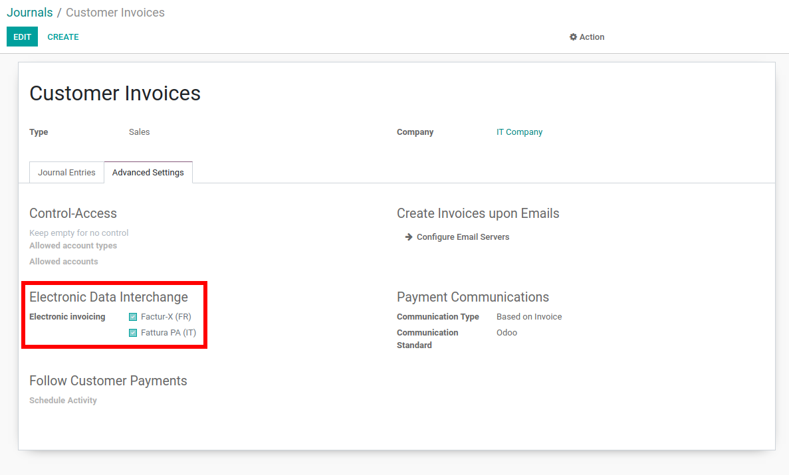
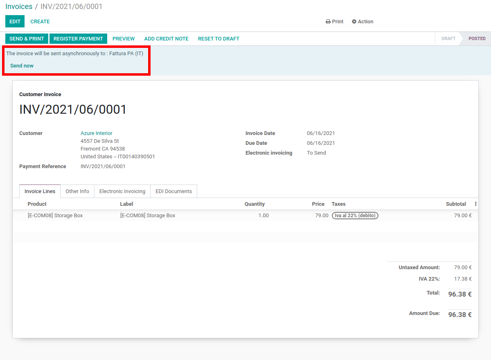
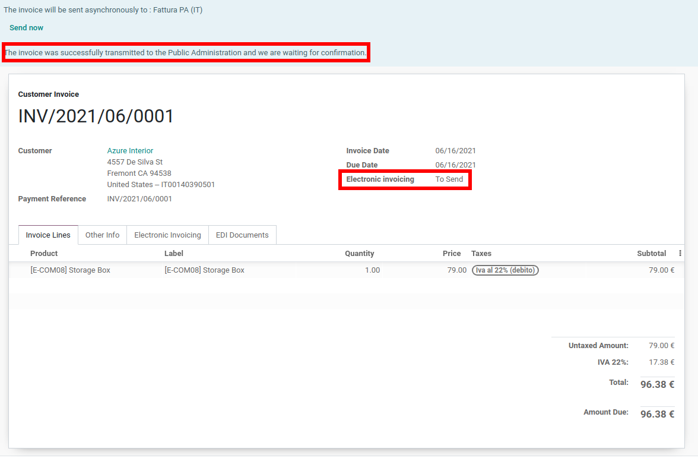
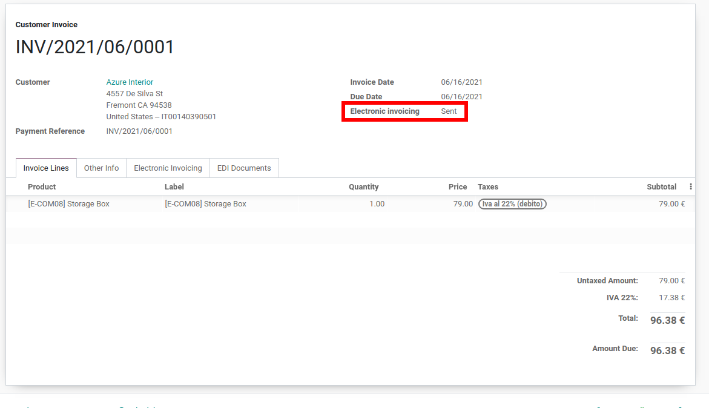
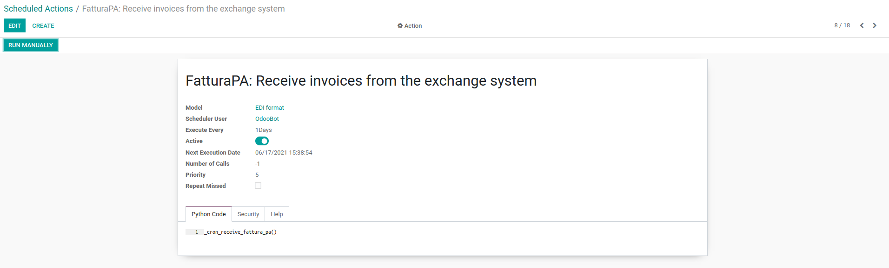

===============
Italy (Sdicoop)
===============

Allow the user to generate the EDI document for Italian invoicing.

This module allows the creation of the EDI documents and the communication with the Sdicoop web-service of FatturaPA to send/receive invoices and notifications.

Please note that once this module is installed, it's no longer possible to send invoice via PEC mail.

Usage
=====

Setup the Codice Destinatario on FatturaPA
------------------------------------------

In order for Odoo to be able to receive invoices and notifications from third parties, you need to inform the FatturaPA service that Odoo is the allowed party to proccess files for you. To do that, you must setup Odoo's *Codice Destinatario* on the FatturaPA portal.

TODO

Give Odoo permission to process file
------------------------------------

Since the files are transmitted through Odoo's server before being sent to Sdicoop or received by your database, you need to authorize Odoo to process your files from your database.

To do this, simply go to on :menuselection:`Accounting --> Settings --> Electronic Invoicing` and click on *Register*.

Note that all your file are encrypted upon reception in such a way that only you are able to decrypt it.

Sending an invoice
------------------

First, make sure that FatturaPA is selected on your journal.

Then, simply send an invoice the way you would do it normally. The EDI process will proceed automatically.

You can check the current status of your invoice here :

Receiving invoices
------------------

This process is taken care by a cron, that you can still run manually if needed :

